# Wehackers Designs
Mockup for Wehackers web App and broswer extension

## What is Wehackers.club?
Wehackers.club is link sharing online community designed for developers and designers. It collects and automatically ranks tutorials, tools, video, articles, libraries and frameworks based user's votes, allowing the beginner to find the worth most learning resources without going through painful online search. It helps expert to find the update to tools and technologies, potentially improving their productivities. It's also the playground for cutting-edge enthusiastic, sharing their exciting findings and getting acknowledged by the community. 

## Getting Started
### Rerequisites
[Sketch](https://www.sketchapp.com) is required to edit the design documents and export the assets.

## Previews
### Web App
Landing page
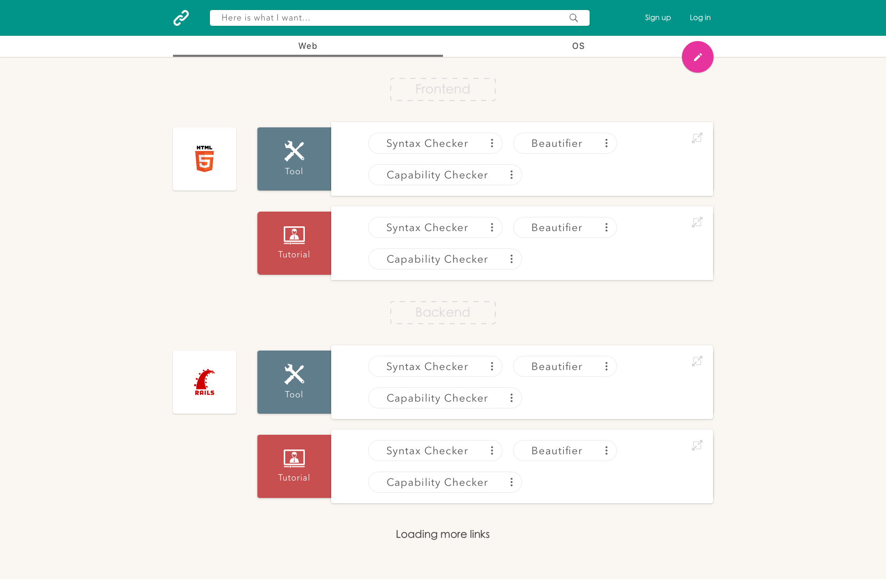

Real-time search

Vote on link
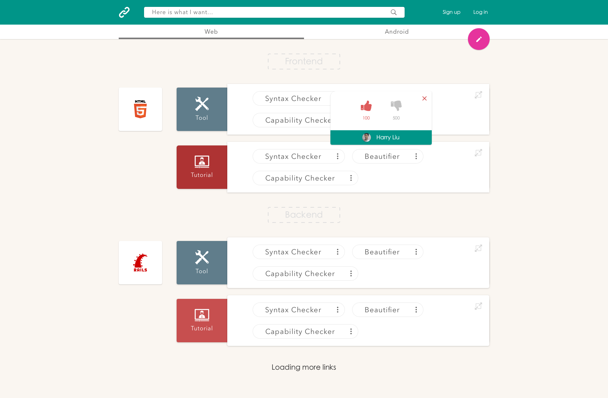

Sign in popup
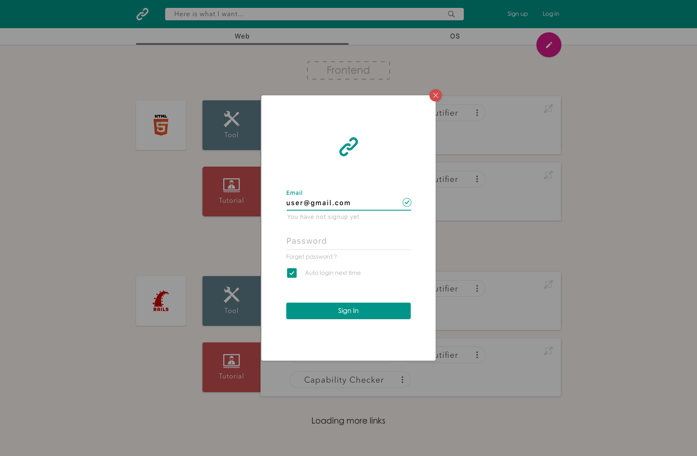

User signed in

User info
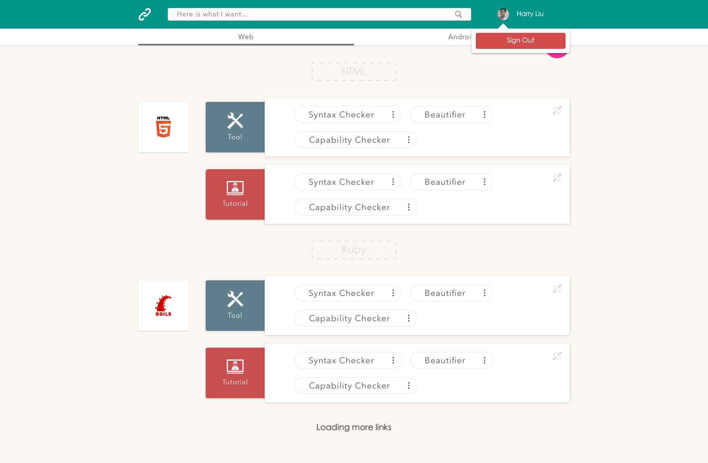

Organize categories
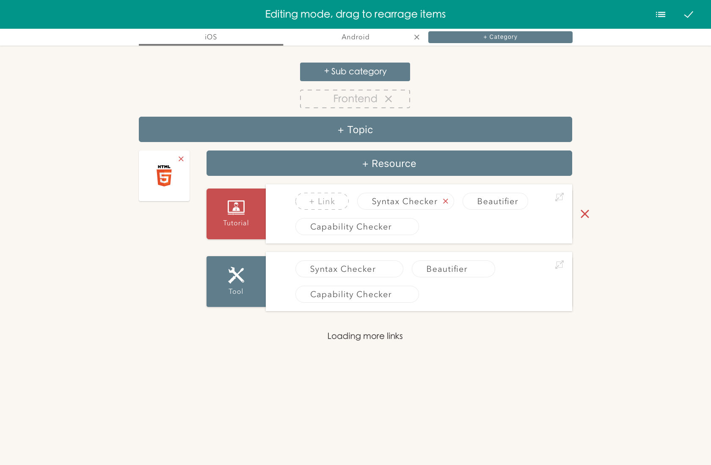

Add link popup
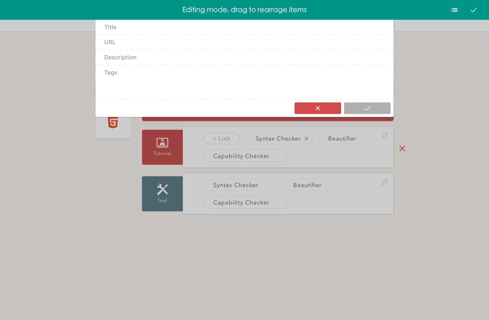

Add a sample link
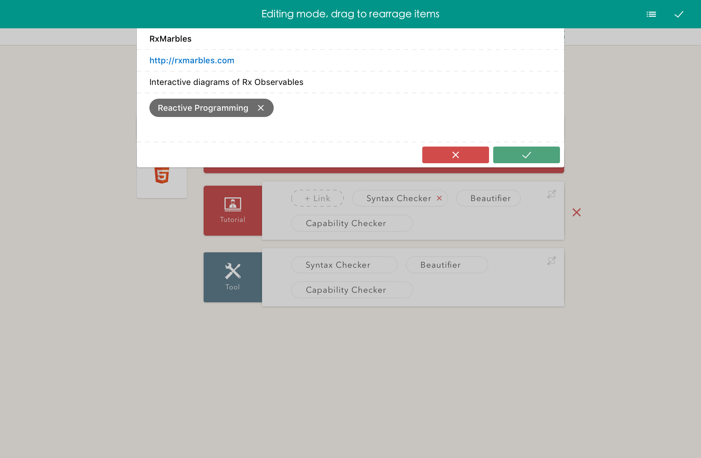

Search link to categorize
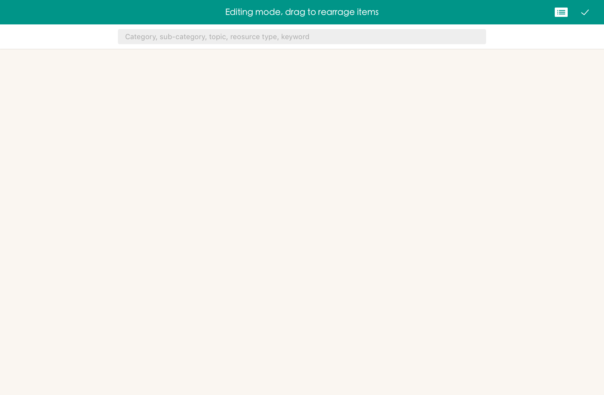

### Broswer extension

Sign in

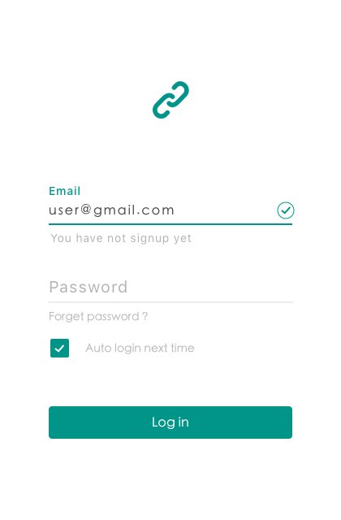

Import bookmarks

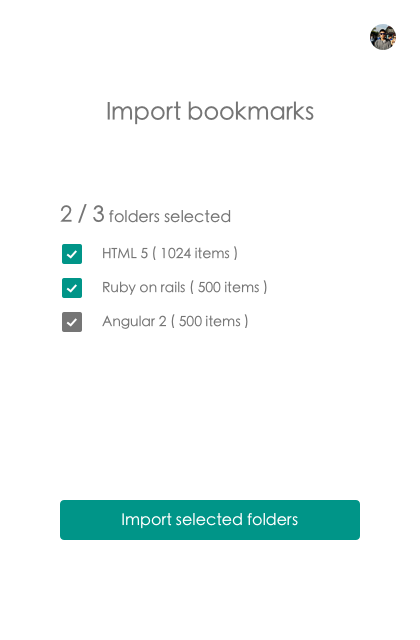

Importing bookmarks

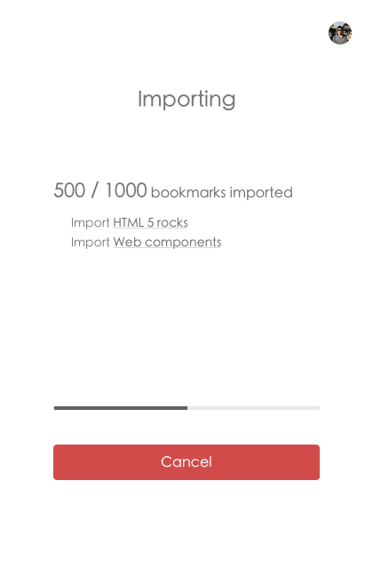

Imported bookmarks

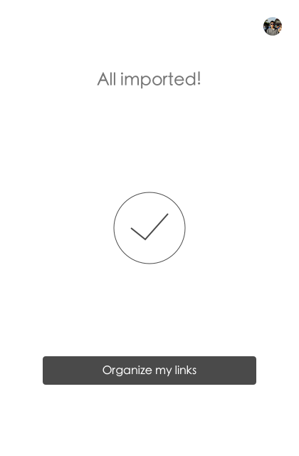

Contribution

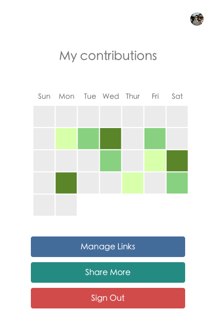

## Author
[byliuyang] (https://github.com/byliuyang/)  -- **Initial works**

 
 
  