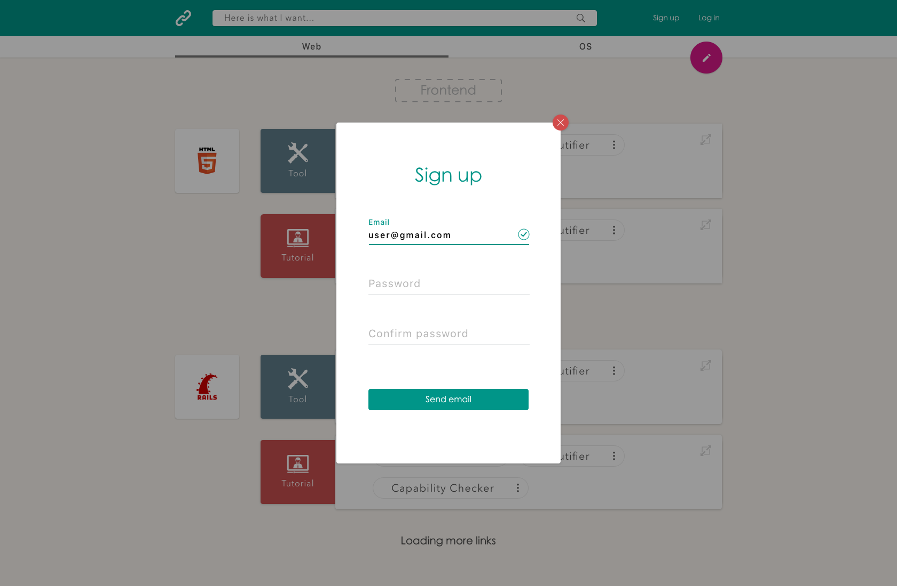
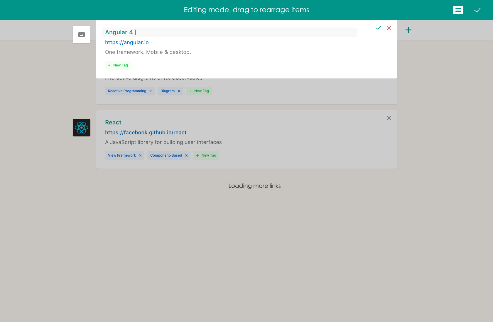

# Wehackers Designs
Design assets for Wehackers web App and browser extension

## What is Wehackers.club?
Wehackers.club is a link sharing online community designed for developers and designers. It collects and algorithmically ranks tutorials, tools, video, articles, libraries and frameworks based on user's votes, allowing beginners to directly find the most worthwhile learning resources and bypass painful online research. It helps experts to find the most up to date tools and technologies, potentially improving their productivity. It's also a playground where cutting-edge enthusiasts can share their exciting findings and gain community acknowledgment. 

## Getting Started
### Rerequisites
[Sketch](https://www.sketchapp.com) is required to edit the design documents and export the assets.

## Previews
### Web App
Landing page

Real-time search

Vote on link

Sign in popup

Sign up popup

User signed in

User info

Organize categories

Search link to categorize

Add link popup

Add example link

### Broswer extension

Sign in

Import bookmarks

Importing bookmarks

Imported bookmarks

Contribution

## Authors
[byliuyang](https://github.com/byliuyang) - **Initial works**
